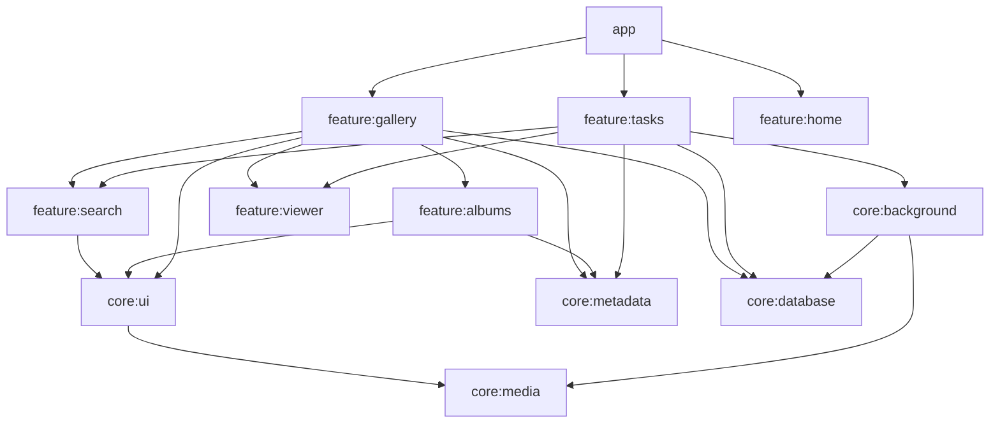

# 浮生册工程接手说明

这是供后续业务开发使用的 Android 多模块工程。2026 年 10 月 2 日的整理将现有事项、搜索和卷册功能从应用入口拆出，公共存储与缩略图下沉到基础模块。现有页面和存储格式保留，后续具体功能由项目接手者继续开发。

## 先运行

需要 JDK 17、Android SDK 35 和 Android 8.0 以上的设备或模拟器。在 Android Studio 打开本目录，配置 SDK；命令行也可设置 `ANDROID_HOME`，或在本机的 `local.properties` 写入 `sdk.dir`。Gradle Wrapper 固定为 8.11.1，首次运行需联网下载依赖。

```sh
./gradlew :app:assembleDebug
./gradlew verifyFoundation
```

Windows 使用 `gradlew.bat`。APK 输出在 `app/build/outputs/apk/debug/app-debug.apk`。

`verifyFoundation` 检查编译、Lint、模块依赖边界和受限资产。发布前另跑许可证门槛：

```sh
./gradlew checkLicense generateLicenseReport
```

许可证检查保留为独立门槛，不能把基础验证通过当作发布审核通过。交接安排见 [HANDOFF.md](HANDOFF.md)。不要把 `.local-android`、缓存、构建输出或 `local.properties` 放进源码仓库。

## 模块职责

| 模块 | 职责与主要入口 |
| --- | --- |
| `app` | 启动、系统权限、外部分享/提醒入口、主题和顶层页面组装；`MainActivity`、`FuShengCeApp` |
| `core:media` | 只读 MediaStore、分页、影像模型、整理候选规则；`MediaRepository`、`AndroidMediaRepository` |
| `core:database` | Room 数据库、扫描记录和事项记录、数据库迁移 |
| `core:background` | 后台扫描、晚间提醒、事项提醒与调度 |
| `core:metadata` | 本机收藏、题记、卷册及收录关系；`LocalFavorites`、`LocalCaptions`、`LocalAlbums` |
| `core:ui` | 多个页面共用的影像缩略图与视频时长显示；`MediaThumbnail` |
| `feature:home` | 既有首页状态、角色反馈和冻结视觉资源 |
| `feature:gallery` | 相册浏览及归册流程组装；`MediaGalleryFlow`、`GalleryScreen`、`GalleryViewModel` |
| `feature:viewer` | 照片/视频查看、详情操作、照片 GPS 导航；`ViewerScreen` |
| `feature:search` | 日期、文件名、题记及候选搜索，离线语音输入；`SearchScreen`、`searchMedia` |
| `feature:albums` | 卷册列表、成员选择与整理界面；`AlbumCollectionScreen` |
| `feature:tasks` | 工作/生活事项、编辑、地点跳转、事项搜索结果；`TaskWorkspace` |

现有静态首页样机和主题还在 `app`，不是已完成的正式 3D 首页。冻结视觉母版与相关限制仍以 [AGENTS.md](AGENTS.md) 为准。

## 依赖方向



图中省略部分指向 `core:media` 的直接依赖；实际依赖以各模块的 `build.gradle.kts` 为准。

基础模块不能依赖业务模块，任何库模块不能反向依赖 `app`。业务模块之间只允许归册流程组装搜索、卷册、查看器，以及事项流程组装搜索、查看器。`verifyModuleBoundaries` 会阻止越界依赖。共享组件放在合适的 `core` 模块，避免为了一个组件让两个业务模块相互依赖。

新增代码模块使用 `core:*` 或 `feature:*` 命名；未分类模块会被拒绝，防止通过中间模块绕过边界。

## 后续功能怎么接

**改现有功能：**先进入对应的 `feature`。页面间通过参数、状态和回调传递数据，不引用另一个模块的内部页面实现。`app` 只增加必要的入口和顶层组装。

**新增独立业务：**按现有业务模块创建 Android Library，在 `settings.gradle.kts` 注册，并在实际调用方的 `build.gradle.kts` 声明依赖。模块自己的代码、资源、Manifest 和测试放在一起。需要新增跨业务调用时，先确定由哪个流程负责组装，再相应调整依赖规则。

**扩展搜索：**纯照片匹配规则放在 `feature/search/.../SearchIndex.kt`。事项结果由 `feature:tasks` 通过 `taskResults` Compose 插槽提供；搜索模块不依赖事项模型或事项页面。支持事项模式时，即使结果为空也传非空插槽，由事项模块显示空态；`null` 表示仅照片搜索。

**扩展影像访问：**沿用 `MediaRepository`。`GalleryViewModel` 和 `ViewerViewModel` 接受该接口，可以注入测试实现。读取权限和分页世代号继续由现有逻辑控制；不要在页面主线程扫描文件、绕过授权读取照片或把当前已载入数量当成全库数量。

**扩展数据：**共享的收藏、题记和卷册使用 `core:metadata`；结构化事项及扫描记录使用 `core:database`。数据库仍为 `fushengce.db`，版本 3，保留 1→2→3 迁移。新增表/字段要提供升级迁移，不能用清库重建代替。元数据当前按 UI 串行读写使用；若后续增加多个后台写入方，需先设计串行或事务写入。

**新增后台工作：**进入 `core:background`，继续沿用 WorkManager 或现有提醒调度。保留取消传播、权限检查和失败处理，不在 Composable 内创建独立长期任务。

**新增系统能力：**把 Manifest 声明和实现放在拥有该能力的模块。例：语音权限归 `feature:search`，照片位置权限归 `feature:viewer`。申请授权仍走系统流程，缺少授权不能显示成功状态。

## 兼容范围

此次拆分只移动代码归属并调整模块接口。应用 ID `com.fushengce.app`、数据库名和表结构、提醒 Receiver、通知入口与本机元数据键保持不变。收藏、题记、卷册数据依旧位于 `local-favorites`、`local-captions`、`local-albums` 的 SharedPreferences，不修改原照片。

页面内现有状态与返回行为保留。顶层目前由 `FuShengCeApp` 组装，归册内部由 `MediaGalleryFlow` 组装；未新增路由框架、依赖注入框架或未来功能空壳。历史 `AppDestination` 定义不是当前正在使用的 NavHost，不要据此误判实际跳转链。

## 当前交付边界

这是供朋友继续开发的框架源码包。照片具有有效 GPS 且获得照片位置权限时，查看页导航键可用；没有可读取坐标时禁用。

仓库按交付要求不包含测试代码、测试脚本、测试照片、测试报告、本机运行记录、模拟器、缓存或 APK。首页源码直接引用的四张内置占位图属于现有页面运行资源，予以保留；它们不是真实用户相册，也不能作为角色视觉参考。

正式 3D 角色、人物/事件语义索引、OCR、完整真机验收尚未完成。地图应用跳转、离线语音、提醒送达、大相册性能和带历史数据升级仍需接手者验证。页面规划不代表功能已经实现。

当前交付仓库为 `Paayamok/cvphoto`，使用 `main` 作为框架交付入口。旧仓库的分支、PR 和自动开发任务不属于本仓库；不要恢复原自动任务。
